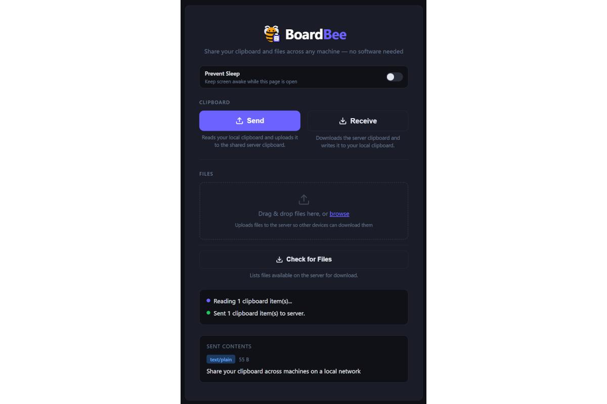
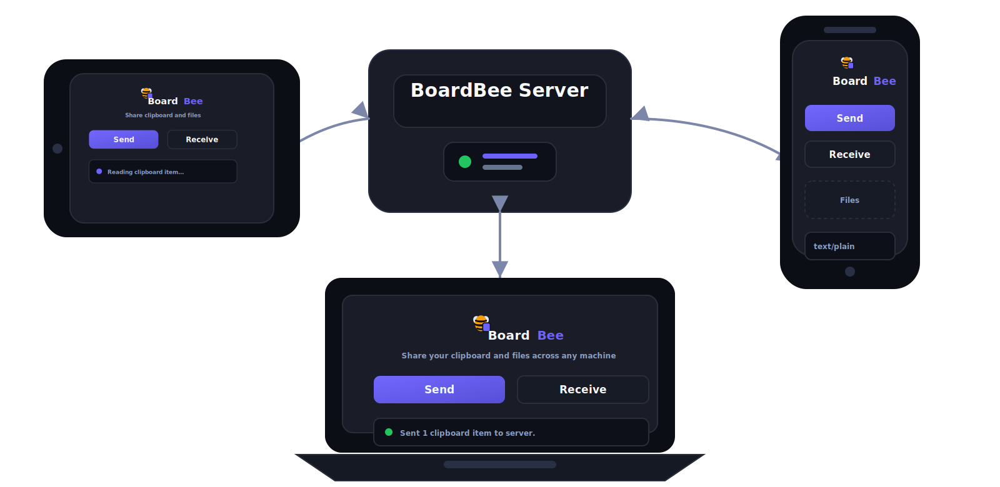

# BoardBee

Share your clipboard across machines on a local network — no native software required on client devices.



## Features

* Send and receive clipboard contents.
* Support all clipboard MIME types - plain text, rich text, images and more.
* Easily send and receive files between devices.
* "Prevent Sleep" option to keep client devices awake (where supported).
* All data stays on your local home network.
* No accounts or sign-ups required.



## Requirements

- [Node.js](https://nodejs.org/) 18+ on the machine running the server
- A modern browser (Chrome 76+, Edge 79+, Firefox 127+, Safari 13.1+) on client machines

## Setup

```sh
npm install
npm start
```

On startup the server prints every URL it is reachable on:

```
BoardBee is running over HTTPS.

  Local:   https://localhost:8443
  LAN:     https://192.168.1.67:8443

Browser setup (one-time per device):
  Open the URL above, click "Advanced" on the cert warning, then "Proceed".
  You only need to do this once per browser per device.
```

## Why HTTPS?

The browser Clipboard API (`navigator.clipboard.read` / `navigator.clipboard.write`) is restricted to [secure contexts](https://developer.mozilla.org/en-US/docs/Web/Security/Secure_Contexts). `localhost` qualifies automatically, but any other hostname or IP requires HTTPS.

BoardBee solves this by generating a **self-signed TLS certificate** at startup (via [`selfsigned`](https://www.npmjs.com/package/selfsigned)). The certificate covers `localhost` and every LAN IP address found on the server machine, so any of the printed URLs will work. No `openssl` or external tools are needed.

The cert is ephemeral — regenerated each time the server starts. It is never written to disk.

### One-time browser trust step (per client device)

Because the cert is self-signed, browsers will show a security warning the first time you visit. Accept it once:

| Browser | Steps |
|---------|-------|
| Chrome / Edge | Click **Advanced** → **Proceed to `<address>` (unsafe)** |
| Firefox | Click **Advanced** → **Accept the Risk and Continue** |
| Safari | Click **Show Details** → **visit this website** → confirm |

After accepting, the warning does not appear again for that browser/URL combination until the cert expires (30 days) or the server restarts.

## Usage

1. Open the BoardBee URL in a browser on each machine you want to share between.
2. Grant clipboard permission when the browser prompts.
3. **Send** — reads your local clipboard and uploads it to the server.
4. **Receive** — downloads the server clipboard and writes it to your local clipboard.

A preview of the clipboard contents (text or image) is shown after each operation.

## Configuration

| Environment variable | Default | Description |
|----------------------|---------|-------------|
| `PORT` | `8443` | TCP port the HTTPS server listens on |

```sh
PORT=9443 npm start
```


**API**

| Method | Path | Description |
|--------|------|-------------|
| `GET`  | `/api/clipboard` | Returns `{ items, lastUpdated }` |
| `POST` | `/api/clipboard` | Accepts `{ items: [{type, data}] }` |

Each item carries `type` (MIME type string) and `data` (base64-encoded bytes). The server accepts payloads up to **50 MB**.

## Security notes

- There is no authentication. Anyone who can reach the server URL can read and overwrite the shared clipboard.
- The clipboard contents live only in server process memory and are lost on restart.
- Use on a trusted local network only.
