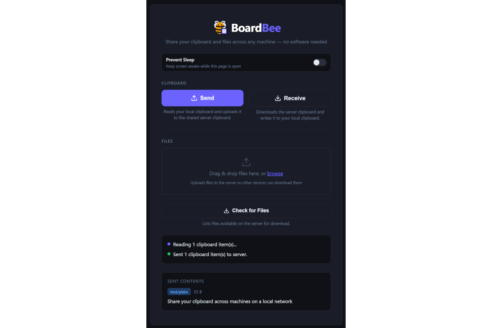
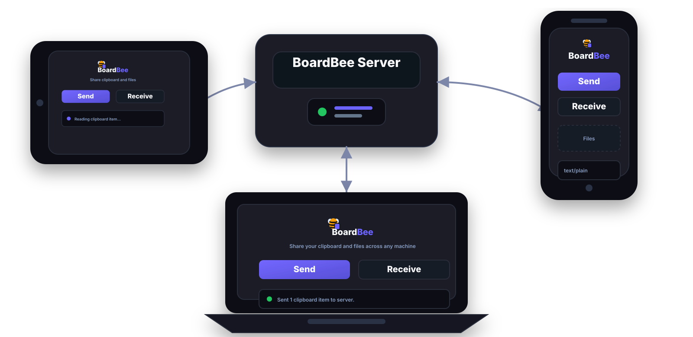

# BoardBee

Share your clipboard across machines on a local network — no native software required on client devices.



## Features

* Send and receive clipboard contents.
* Support all clipboard MIME types - plain text, rich text, images and more.
* Easily send and receive files between devices.
* "Prevent Sleep" option to keep client devices awake (where supported).
* All data stays on your local home network.
* No accounts or sign-ups required.



## Requirements

- [Node.js](https://nodejs.org/) 18+ on the machine running the server
- A modern browser (Chrome 76+, Edge 79+, Firefox 127+, Safari 13.1+) on client machines

## Setup

```sh
npm install
npm start
```

On startup the server prints every URL it is reachable on, along with a
one-time passcode clients must enter to connect:

```
BoardBee is running over HTTPS.

  Local:   https://localhost:8443
  LAN:     https://192.168.1.67:8443

Browser setup (one-time per device):
  Open the URL above, click "Advanced" on the cert warning, then "Proceed".
  You only need to do this once per browser per device.

  Passcode:  492017
  Enter this passcode when prompted in the browser to connect.
```

The passcode is regenerated on every start. After entering it once, a browser
session cookie keeps the device authenticated for 7 days (or until the server
restarts).

## Why HTTPS?

The browser Clipboard API (`navigator.clipboard.read` / `navigator.clipboard.write`) is restricted to [secure contexts](https://developer.mozilla.org/en-US/docs/Web/Security/Secure_Contexts). `localhost` qualifies automatically, but any other hostname or IP requires HTTPS.

BoardBee solves this by generating a **self-signed TLS certificate** at startup (via [`selfsigned`](https://www.npmjs.com/package/selfsigned)). The certificate covers `localhost` and every LAN IP address found on the server machine, so any of the printed URLs will work. No `openssl` or external tools are needed.

The cert is ephemeral — regenerated each time the server starts. It is never written to disk.

### One-time browser trust step (per client device)

Because the cert is self-signed, browsers will show a security warning the first time you visit. Accept it once:

| Browser | Steps |
|---------|-------|
| Chrome / Edge | Click **Advanced** → **Proceed to `<address>` (unsafe)** |
| Firefox | Click **Advanced** → **Accept the Risk and Continue** |
| Safari | Click **Show Details** → **visit this website** → confirm |

After accepting, the warning does not appear again for that browser/URL combination until the cert expires (30 days) or the server restarts.

## Usage

1. Open the BoardBee URL in a browser on each machine you want to share between.
2. When prompted, enter the 6-digit passcode printed on the server console.
3. Grant clipboard permission when the browser prompts.
4. **Send** — reads your local clipboard and uploads it to the server.
5. **Receive** — downloads the server clipboard and writes it to your local clipboard.

A preview of the clipboard contents (text or image) is shown after each operation.

## Configuration

BoardBee can be configured via environment variables, a JSON config file, or both. **Environment variables take precedence over the config file**, which takes precedence over built-in defaults.

### Options

| Option           | Env var           | Default        | Description                                                                                     |
|------------------|-------------------|----------------|-------------------------------------------------------------------------------------------------|
| `port`           | `PORT`            | `8443`         | TCP port the HTTPS server listens on                                                            |
| `bindAddresses`  | `BIND_ADDRESSES`  | all interfaces | List of IP addresses to bind to. Omit/empty to listen on all interfaces (default behavior).     |
| *(config path)*  | `CONFIG`          | *(auto)*       | Path to a JSON config file. If unset, `boardbee.config.json` is searched in cwd then server dir. |

`BIND_ADDRESSES` is a comma-separated string, e.g. `BIND_ADDRESSES=127.0.0.1,192.168.1.67`.

### Config file

A JSON file named `boardbee.config.json` (see `boardbee.config.example.json` for a template):

```json
{
  "port": 9443,
  "bindAddresses": ["127.0.0.1", "192.168.1.67"]
}
```

The file is searched at, in order:
1. the path given by the `CONFIG` env var
2. `./boardbee.config.json` (current working directory)
3. `boardbee.config.json` next to `server.js`

### Examples

```sh
# env vars only
PORT=9443 npm start
BIND_ADDRESSES=127.0.0.1 npm start

# config file
cp boardbee.config.example.json boardbee.config.json
npm start

# explicit config path
CONFIG=/etc/boardbee.json npm start
```

When `bindAddresses` is set, BoardBee listens **only** on the listed addresses (one listener per address) and the TLS certificate covers exactly those addresses plus `localhost`/`127.0.0.1`. This is useful for restricting the server to a single interface or exposing it on a specific IP.


**API**

| Method | Path | Description |
|--------|------|-------------|
| `POST` | `/api/auth` | Submit `{ passcode }` to obtain a session cookie |
| `GET`  | `/api/auth/check` | Report whether the current session is authenticated |
| `POST` | `/api/auth/logout` | Clear the session cookie |
| `GET`  | `/api/clipboard` | Returns `{ items, lastUpdated }` (requires auth) |
| `POST` | `/api/clipboard` | Accepts `{ items: [{type, data}] }` (requires auth) |

Each item carries `type` (MIME type string) and `data` (base64-encoded bytes). The server accepts payloads up to **50 MB**.

## Security notes

- **Passcode authentication** is required. On startup the server generates a random 6-digit passcode and prints it to the console. Clients must enter it to obtain a session cookie (HTTP-only, `Secure`, `SameSite=Strict`, 7-day lifetime). The passcode is regenerated on every restart.
- The clipboard contents live only in server process memory and are lost on restart.
- Use on a trusted local network only.
